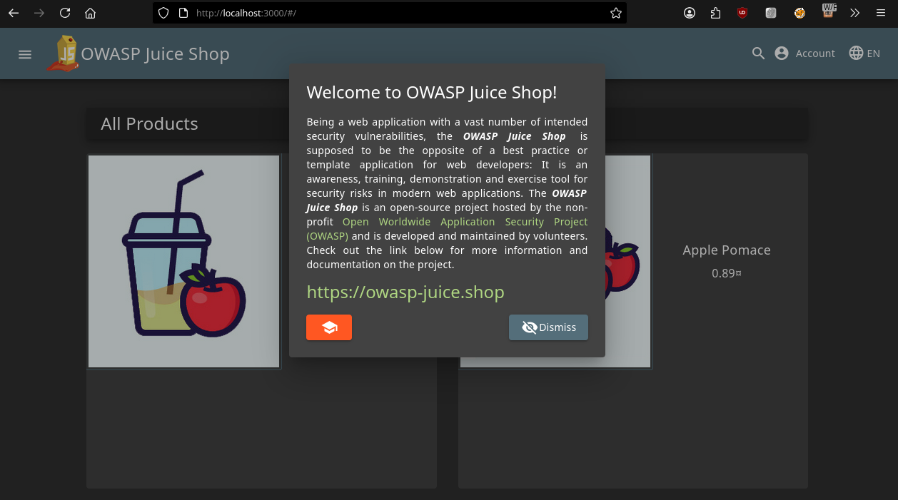
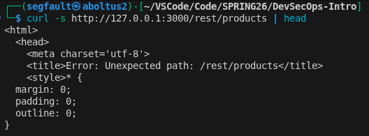

# Triage Report — OWASP Juice Shop

## Scope & Asset
- Asset: OWASP Juice Shop (local lab instance)
- Image: bkimminich/juice-shop:v19.0.0
- Release link/date: https://github.com/juice-shop/juice-shop/releases/tag/v19.0.0 — September 3, 2025
- Image digest: `sha256:37cc73163c4c269c044e890fee868d62637109cad126a26dab13dc442ef2ae76`

## Environment
- Host OS: `Kali Linux 6.17.10+kali-amd64`
- Docker: Docker version 29.1.4, build 0e6fee6

## Deployment Details
- Run command used: `docker run -d --name juice-shop -p 127.0.0.1:3000:3000 bkimminich/juice-shop:v19.0.0`
- Access URL: http://127.0.0.1:3000
- Network exposure: 127.0.0.1 only

## Health Check
- Page load:
 
- API check: first 5–10 lines from `curl -s http://127.0.0.1:3000/rest/products | head`

## Surface Snapshot (Triage)
- Login/Registration visible: [x] Yes — Homepage for new users is present
- Product listing/search present: [x] Yes — Main page shows products with search functionality
- Admin or account area discoverable: [x] Yes — Via login, discover /#/administration after auth
- Client-side errors in console: [ ] Yes [x] No — DevTools console is clean on load
- Security headers (quick look — optional): `curl -I http://127.0.0.1:3000` shows no security headers

## Risks Observed (Top 3)
- SQLi — Multiple endpoints vulnerable to SQLi, allowing data extraction or manipulation (critical risk in login/products)
- Authorization Bypass — API flaws enable role escalation or admin access without proper checks (critical for privilege escalation)
- Cross-Site Scripting (XSS) — Reflected/stored XSS in search/comments, executable in user browsers (high risk for session theft)

## GitHub Community

**Starring repositories** matters in open source because it bookmarks useful projects for your future reference, signals appreciation to maintainers (boosting their motivation), and increases project visibility through GitHub's algorithms. High star counts attract more contributors and help you showcase relevant technologies on your profile to potential employers

**Following developers** helps team projects by keeping you updated on classmates' progress and code patterns, while professionally it exposes you to real-world problem-solving approaches and builds your network for future collaborations and career opportunities